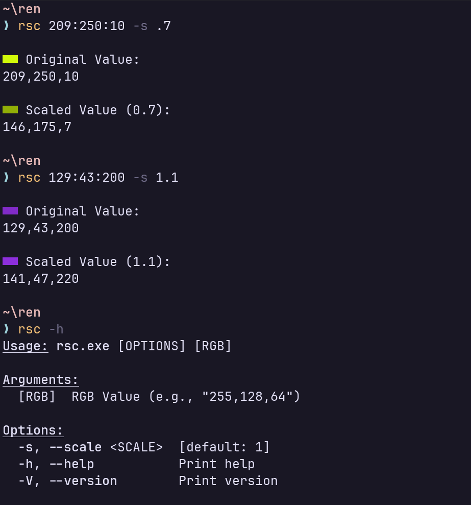

# rgb-scale

Simple CLI for scalling RGB values.

## Usage



## Installation

You can grab the binary from the [release]() or you can build and install it.

Install to Rust's Default Binary Path.

```bash
cargo install --path .
```
